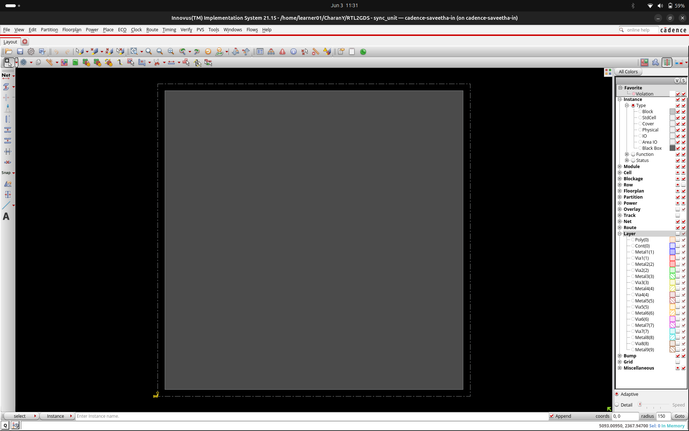
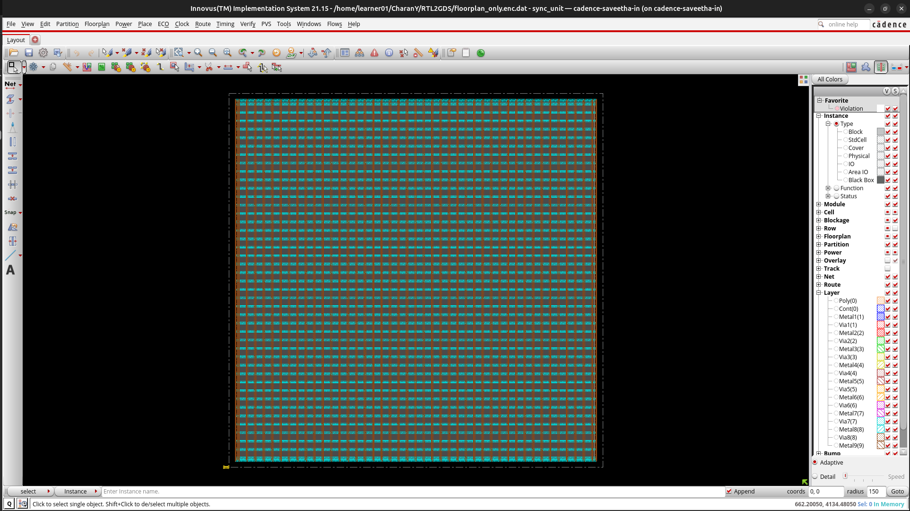
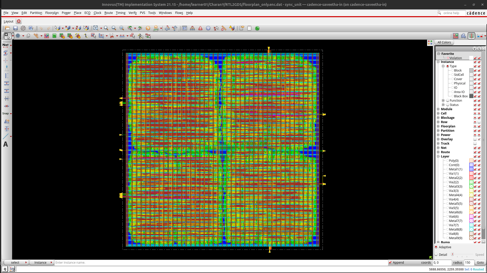
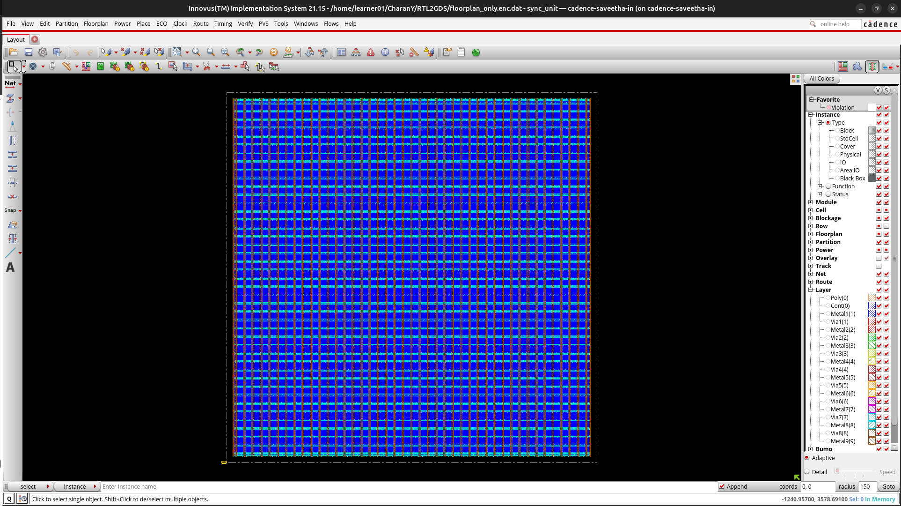

# Multi-Clock FIFO Synchronization Unit RTL-to-GDSII ASIC Implementation

Complete RTL-to-GDSII physical implementation of a multi-clock FIFO-based synchronization subsystem using Cadence Genus and Innovus on the GPDK090 technology node.

The project demonstrates a full ASIC backend implementation flow including synthesis, floorplanning, power planning, placement, clock tree preparation, routing, timing analysis, physical verification, and GDSII generation.

---

## Design Overview

The design consists of asynchronous and synchronous FIFO architectures operating across multiple clock domains.

Primary objectives:

* Clock Domain Crossing (CDC)
* Safe asynchronous data transfer
* FIFO-based synchronization
* ASIC physical implementation methodology

---

## System Architecture

```text
                cam1_pclk
                    │
                    ▼
          +------------------+
          |    Async FIFO    |
          +------------------+
                    │
                    ▼
          +------------------+
          | Synchronization  |
          |      Logic       |
          +------------------+
                    │
                    ▼
          +------------------+
          |    Sync FIFO     |
          +------------------+
                    │
                    ▼
                  sys_clk
```

---

## ASIC Implementation Flow

```text
RTL Design
    │
    ▼
Logic Synthesis
    │
    ▼
Floorplanning
    │
    ▼
Power Planning
    │
    ▼
Placement
    │
    ▼
Pre-CTS STA
    │
    ▼
Clock Tree Preparation
    │
    ▼
Routing
    │
    ▼
Post-Route STA
    │
    ▼
DRC Verification
    │
    ▼
GDSII Generation
```

---

## Tools Used

| Stage                 | Tool            |
| --------------------- | --------------- |
| RTL Synthesis         | Cadence Genus   |
| Floorplanning         | Cadence Innovus |
| Power Planning        | Cadence Innovus |
| Placement             | Cadence Innovus |
| Timing Analysis       | Cadence Innovus |
| Routing               | Cadence Innovus |
| Physical Verification | Cadence Innovus |
| GDSII Stream-Out      | Cadence Innovus |

---

## Technology

| Parameter             | Value           |
| --------------------- | --------------- |
| Technology Node       | GPDK090         |
| Process               | 90nm CMOS       |
| Standard Cell Library | GPDK090 Library |

---

## Physical Design Snapshots

### Floorplan



---

### Power Planning



---

### Placement



---

### Routing



---

## Demo Video

[▶ RTL-to-GDSII Flow Demo](docs/rtl_to_gdsii_demo.webm)

## Implementation Statistics

| Metric                | Value     |
| --------------------- | --------- |
| Standard Cells        | 1,298,235 |
| Fixed Cells           | 521,304   |
| Clock Sinks           | 442,659   |
| Placement Utilization | 62.90%    |
| Routing Overflow      | 0.00%     |
| Total Routed Nets     | 777,001   |
| Total Wire Length     | 42.29 mm  |
| Total Vias            | 9,966,779 |

---

## Timing Analysis

### Pre-CTS Timing

| Metric          | Value        |
| --------------- | ------------ |
| WNS             | -46.370 ns   |
| TNS             | -4.74e+06 ns |
| Violating Paths | 432,000+     |

These violations are expected due to the large multi-clock FIFO architecture and serve as timing analysis data for physical design exploration.

---

## Routing Results

```text
Routing Overflow:
Horizontal : 0.00%
Vertical   : 0.00%

Total Wire Length:
42.29 mm

Total Vias:
9,966,779
```

---

## Physical Verification

### DRC Summary

| Check                 | Result    |
| --------------------- | --------- |
| DRC Executed          | Yes       |
| Geometry Verification | Yes       |
| Signoff Analysis      | Performed |

Detailed reports are available in the `reports/` directory.

---

## Generated Deliverables

* Synthesized Netlist
* Timing Reports
* Area Reports
* Power Reports
* Floorplan Database
* Placement Database
* Routed Database
* DRC Reports
* Post-Route STA Reports
* Final GDSII Layout

---

## Repository Structure

```text
rtl/
constraints/
scripts/
reports/
database/
gds/
docs/
```

---

## Skills Demonstrated

* RTL-to-GDSII Flow
* ASIC Physical Design
* Clock Domain Crossing
* FIFO Architecture
* Cadence Genus
* Cadence Innovus
* Floorplanning
* Power Planning
* Placement
* Routing
* Static Timing Analysis
* Physical Verification
* GDSII Generation

---

## Disclaimer

This project was completed as an academic ASIC physical design implementation exercise to gain hands-on experience with industry-standard RTL-to-GDSII methodologies and backend EDA tools.

